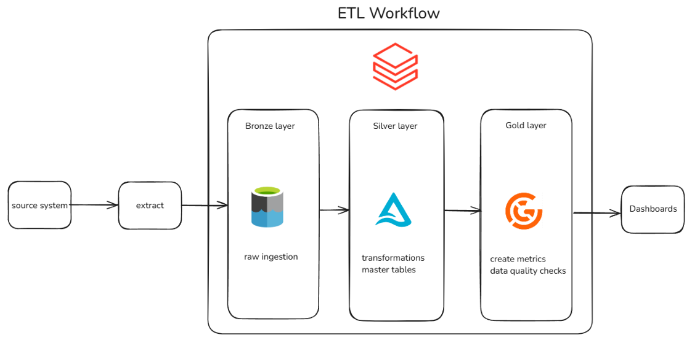

# 🚀 Capstone Project: ETL Pipeline on Azure Databricks

This project implements a complete ETL pipeline using **Azure Databricks**, following the **Medallion Architecture (Bronze–Silver–Gold layers)**. It simulates a real-world enterprise solution by ingesting, transforming, and validating structured sales data using PySpark, Delta Lake, and Azure Data Lake Storage Gen2.

---

## 📌 Overview

- **Source**: Simulated client system using Azure Data Lake Gen2
- **Pipeline**: Developed in **Databricks**, with core functionality packaged in a reusable `.whl` file
- **Data**: 6 CSV files (1 fact table and 5 dimension tables)

- **Layers**:
  - 🟫 **Bronze**: Raw ingestion (CSV → CSV)
  - 🟪 **Silver**: Cleaned and transformed data (CSV → Delta)
  - 🟨 **Gold**: Aggregated and joined metrics (saved as Parquet)

- **Validation**: Data quality checks using **Great Expectations** and unit tests using **Pytest**

## ETL Workflow Overview
The diagram below illustrates the ETL pipeline built with Databricks, following the Medallion architecture (Bronze → Silver → Gold):




---

## 🛠️ Technologies Used

- **Azure Databricks**
- **Azure Data Lake Storage Gen2**
- **Python 3.11**
- **PySpark 3.5.4**
- **Delta Lake 3.3.1**
- **Great Expectations**
- **Pytest**, **Poetry**, **Pre-commit**

---

## 🧱 Data Architecture


### 🟫 Bronze Layer
- Ingests raw CSV files from the source system (simulated client system)
- Saves unmodified data as CSV files in the `bronze` folder of ADLS Gen2

### 🟪 Silver Layer
- Reads CSV files from the Bronze layer and applies transformation logic:
  - Selects and renames columns
  - Casts data types
  - Drops duplicate records
  - Replaces `"NA"` strings with `None`
  - Adds calculated fields
-  Writes cleaned data as **Delta tables** to the Silver layer as master tables:
  - **Fact table (`sales`)**: `append` mode
  - **Dimension tables**: `merge` mode (SCD Type 1)

### 🟨 Gold Layer
- Joins fact and dimension tables to create enriched datasets
- Outputs:
  - `wide_sales` (denormalized view)
  - `daily_sales_metrics`
  - `daily_product_category_metrics`
- Saves results as **Parquet files**
- Ready for reporting tools such as **Power BI or Tableau**
- Performs data validation using **Great Expectations**

---

## 🧪 Tests & Validation

- All transformation logic is tested using **Pytest**
- Data quality assertions are managed through **Great Expectations**
- Sample test data mimics the Bronze-layer input schema and enables transformation logic validation

---

## 📁 Project Structure
```plaintext
.venv/
dist/
src/
  etl/
    bronze/
      extract_and_load_file.py
    silver/
      calendar.py
      customers.py
      product_category.py
      product_subcategory.py
      products.py
      sales.py
      scd.py
    gold/
      daily_product_category_metrics.py
      daily_sales_metrics.py
      wide_sales.py
  utils/
    authentication.py
    config.py
    datalake.py
tests/
pyproject.toml
```
---

## ▶️ Running the Pipeline
The pipeline was originally executed within a Databricks notebook.

## 📦 Installing Dependencies
Dependencies are managed using **Poetry** and are defined in the pyproject.toml file.
Install them with:

pip install poetry

poetry install

## ✅ Running Tests
Tests can be executed with:

pytest tests/
